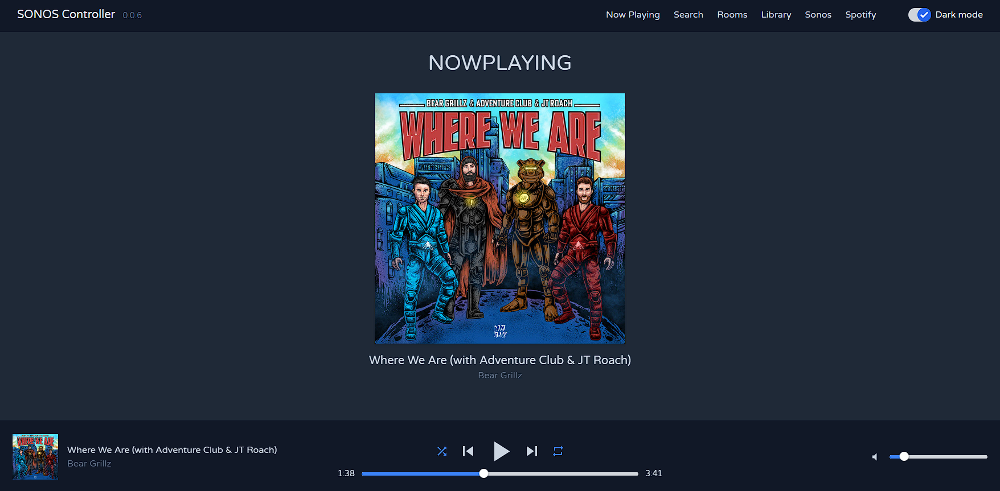
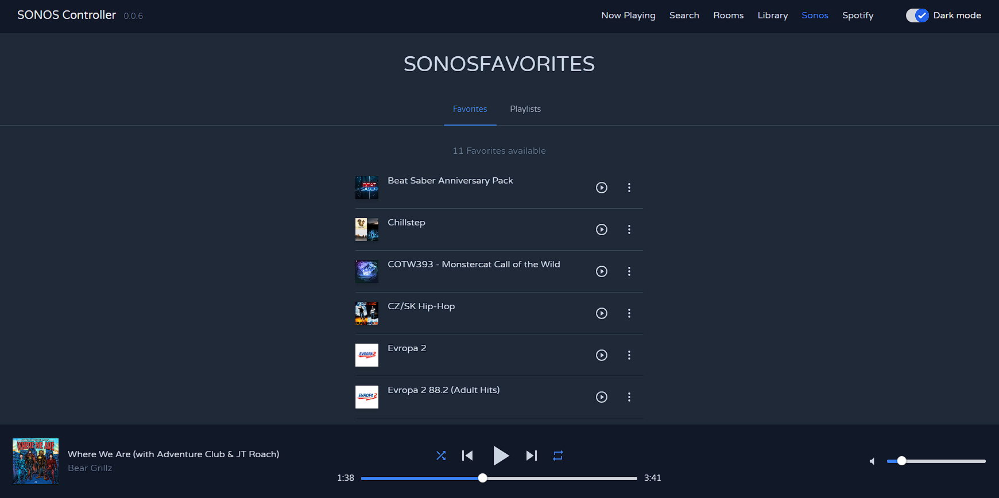

# Sonos Controller

First of all, credits goes to [sonos-web](https://github.com/sonos-web/sonos-web). This is my approach using latest version of Vue.js 3, Pinia, and Tailwind (doing it in my free time, which I have not much really)

Used stack

    

## Features that works
- Sonos network detection
- Music playback from Sonos Favorites (incl. Radio stations)
- Music playback from Spotify
- Music controller (play/pause/prev/next/shuffle/repeat/volume)

## Features to do
- Merging Sonos systems to play simultaineously
- Add more Spotify features
- Search song/album/artist
- Responsive tweaks
- Fix typescript types
- and many more...

Currently serve as a music controller in my "Smart Home" system. Running on Raspberry Pi 4 with touch screen attached. Tested only on IKEA Symphonisk gen.2. Installed via docker.

`docker pull pavolcizmarik/sonos-controller`

Few screens

